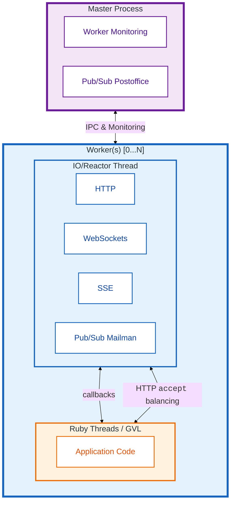

[](https://github.com/boazsegev/iodine)

[](https://github.com/boazsegev/iodine/actions/workflows/posix.yml)
[](https://github.com/boazsegev/iodine/actions/workflows/Windows.yml)
[](http://www.rubydoc.info/github/boazsegev/iodine/master/frames)
[](https://badge.fury.io/rb/iodine)
[](https://rubygems.org/gems/iodine)

# Iodine — a fast, C-powered server and client for Ruby

**Try your existing Rack app on Iodine.** Iodine includes built-in WebSockets, SSE, Pub/Sub, static files, TLS, and hot application restarts.

In a local three-trial benchmark, it delivered ~2.4× Puma's throughput at lower latency.

## Keep Client I/O Moving While Ruby Works

Built on [facil.io](https://facil.io), Iodine runs [Rack](https://github.com/rack/rack) and [NeoRack](https://github.com/boazsegev/neorack) applications and includes an evented client for TCP, HTTP, WebSockets, and SSE.

**Network I/O never waits on the Ruby GVL.** Each worker handles client I/O in a dedicated C reactor thread outside the GVL. A separate pool of Ruby threads runs application code.

This separation lets one worker keep thousands of connections alive while Ruby code executes.

Iodine calls `accept` for new connections only when Ruby threads are available. This automatically routes new connections to the first available worker.



## Install and Try Your App

**Bundler-managed apps:** add Iodine to your Gemfile. Keep your current server gem installed while you evaluate it:

```ruby
# Gemfile
gem "iodine", "~> 0.8"
```

```bash
bundle install
bundle exec iodine
```

Iodine loads `config.ru` (or `config.nru`) from the current directory by default. It accepts `THREADS` and `WORKERS` environment variables.

**Rails apps:** if you use Puma, remove `config/puma.rb` or make its content conditional when switching servers. Iodine honors `RAILS_MAX_THREADS` and `WEB_CONCURRENCY` when not otherwise configured, so most Rails apps need no initializer.

Prefer command-line options and environment variables for code-free configuration updates.

**Standalone Rack apps:** install and run the CLI directly:

```bash
gem install iodine
iodine
```

## Add Real-Time Features Without Extra Infrastructure

**Start without a message broker.** Iodine supports WebSockets and Server-Sent Events in both the server and client. Its built-in Pub/Sub engine routes messages across local worker processes.

A single-host deployment can therefore broadcast without Redis, Valkey, or another service to deploy, monitor, secure, or pay for.

**Add Redis or Valkey when your deployment needs it.** Configure a RESP3-compatible service for external integration or independent broker operations:

```bash
iodine -w -1 -t 8 -r redis://localhost:6379
```

The [API reference](http://www.rubydoc.info/github/boazsegev/iodine) covers programmatic RESP3 setup and direct commands.

**Optional LAN mesh:** connect machines on the same local network through automatic UDP peer discovery. All participating machines must share the broadcast port and secret:

```bash
iodine -w -1 -t 8 -bp 7555 -scrt "my-cluster-secret"
```

Mesh traffic uses ChaCha20/Poly1305 with the shared secret. The `SECRET` and `PUBSUB_PORT` environment variables provide the same settings. The secret may be readable by other users on the same machine, and this feature is lightly tested; please report dropped messages or isolated machines.

## Use Built-In Static Files, Compression, and TLS

**Static files:** serve a public directory without Rack middleware. The C layer answers `GET` and `HEAD` requests directly, bypassing Ruby. Other methods and misses fall through to your app.

When the client supports compression, Iodine serves a neighboring pre-compressed `.br`, `.zstd`, `.gz`, or `.zip` file. It also probes missing extensions (`.html`, `.htm`, `.txt`, `.md`) and directory `index` files.

```bash
iodine -www /my/public/folder
```

**Compression:** dynamic response deflation and WebSocket permessage-deflate are enabled by default; disable them with `-no-dynd` and `-no-wsd`.

**Request logging:** enable request logging with `-v`. Date and time strings are cached to reduce formatting work.

**TLS:** use your own certificate with either OpenSSL or the embedded TLS 1.3.

```bash
iodine -cert cert.pem -key key.pem # OpenSSL backend
iodine -mtls # embedded TLS 1.3
```

The OpenSSL backend is auto-detected at install time. Switch backends at runtime with `Iodine::TLS.default = :iodine` (or `:openssl`). The embedded TLS implementation is unaudited; review its suitability before production use.

Configure client-certificate trust in the binding URL:

```bash
iodine -b https://0.0.0.0/?trust=ca.pem
```

The [API reference](http://www.rubydoc.info/github/boazsegev/iodine) covers per-listener `Iodine::TLS#trust` and peer certificate-chain inspection.

**Security limits:** Iodine sets defaults for HTTP header and body sizes and incoming WebSocket message size. Configure them with `-maxln`, `-maxhd`, `-maxbd`, and `-maxms`. Large HTTP payloads can be diverted to temporary files. See `iodine -h` and load-test your chosen limits and timeouts.

## Tune Workers and Threads for Your Workload

Set explicit worker and thread counts, then measure your workload:

```bash
iodine -t 16 -w 4

# equivalent environment configuration
THREADS=16 WORKERS=4 iodine
```

Without explicit settings, Iodine defaults to `-t -4` and `-w -2`, so cluster mode is enabled. The defaults printed by `iodine -h` reflect any `THREADS` or `WORKERS` variables in your current environment.

Negative values represent fractions of the available CPU cores. On an 8-core machine, `-w -2` starts 4 worker processes:

```bash
iodine -t 1 -w -2  # fast applications: one thread per process, cores/2 processes
iodine -t 4 -w -4  # slower, CPU-heavy applications
iodine -t 5 -w -1  # slower, IO-bound applications
```

Because client I/O runs in the C reactor thread, a single process has been tested with over 20,000 concurrent connections on Linux. Real limits depend on machine resources and application design, not on the server.

On Linux (epoll), macOS and the BSDs (kqueue), Iodine can use worker processes; Windows runs in single-process mode because clustering requires `fork`.

## Hot-Restart Application Code

**Reload application code without restarting the master.** In cluster mode, send `SIGUSR1` to request a hot restart, or use `-hr <seconds>` to schedule worker restarts:

```bash
kill -USR1 <root-process-pid>
# or
iodine -hr 3600
```

A hot restart respawns workers and reloads application code and gems other than Iodine itself. Old workers stop accepting new connections but finish in-flight requests, so both code versions coexist briefly. Use `--preload` instead for copy-on-write memory savings; it disables code swapping.

Two drain limits protect against maliciously slow clients. Clients that have not finished sending their request are disconnected. A worker that cannot finish sending its response within 15 seconds is terminated mid-response (compile-time `FIO_IO_SHUTDOWN_TIMEOUT`, default `15000` ms). Applications with SSE streams or other long-running responses should validate restart and drain behavior explicitly.

## Compare Architectures, Then Benchmark Your App

### Architecture Differences

Puma and Iodine are both multi-process Ruby application servers with per-worker thread pools, worker supervision, and hot restarts. They differ mainly in where the I/O layer lives. Puma uses Ruby threads with `nio4r`; Iodine runs a native C reactor thread outside the GVL.

Most differences below follow from that trade-off.

**Legend:** ✅ supported · 🟡 partial / it depends · 🧩 available via external gem, middleware, or service · ❌ not supported

| | Puma | Iodine |
|---|---|---|
| GVL-free I/O | ❌ | ✅ |
| GVL-free streaming responses | ❌ | ✅² |
| WebSocket server (+ permessage-deflate) | 🧩¹ | ✅ |
| SSE server | 🟡² | ✅ |
| Static file server | 🧩¹ | ✅ |
| Response compression (brotli / gzip) | 🧩¹ | ✅ |
| Cluster-wide Pub/Sub (+ RESP3 scaling) | 🧩¹ | ✅ |
| NeoRack apps (`.nru`) | ❌ | ✅ |
| Resilience to slow-client / connection-flood DoS | 🟡² | ✅ |
| Embedded TLS 1.3 backend (OpenSSL alternative) | ❌ | ✅³ |
| Mutual TLS (client-certificate verification) | 🟡³ | ✅ |
| Battle-tested protocol parsers | ✅ | 🟡³ |
| Built-in stats / control endpoint | ✅ | 🧩¹ |
| Standard Ruby profiling & debugging | ✅ | ❌ |
| JRuby / TruffleRuby support | ✅ | ❌ |
| Windows support | 🟡⁴ | 🟡⁴ |
| HTTP/2 or HTTP/3 | ❌⁴ | ❌⁴ |
| Efficient CPU-bound Ruby work (MRI) | 🟡² | 🟡² |

¹ **External dependencies:** 🧩 features are available via external gems, middleware, or services — at the cost of additional dependencies or infrastructure to operate.

² **Threads & the GVL:** Puma dedicates a Ruby thread to each active connection or `each`-style stream, while Iodine's C reactor and NeoRack's callback streaming avoid consuming Ruby threads. CPU-bound work remains GVL-bound in both.

³ **Security:** both servers ship hand-written C components — Puma's are far more battle-tested, while Iodine's newer security features (embedded TLS, mTLS) are tested in-house but not third-party audited.

⁴ **Platforms:** both servers are POSIX-first — Puma's cluster mode requires `fork`, Iodine's Windows support is unproven, and HTTP/2 is typically handled by a front proxy.

### Local Benchmark

A local hello-world Rack benchmark used 4 workers × 4 threads and `wrk`. It ran on macOS arm64 (16 cores) with Ruby 4.0.1, Iodine 0.8.0.rc.02, and Puma 8.0.2. After a 3-second warmup, each server completed three 10-second measurements. Iodine received `-R` and the explicit `./examples/config-hello.ru` path; Puma received the same Rack file.

| Connections | Server | Requests/sec (median) | Avg latency (median) |
|------------|--------|-----------------------|----------------------|
| 200 | **Iodine** | **199,177** | **0.97 ms** |
| 200 | Puma | 83,345 | 2.38 ms |
| 1000 | **Iodine** | **197,685** | **4.99 ms** |
| 1000 | Puma | 81,878 | 12.12 ms |

These are local measurements, not a promise about your application. The servers and client shared one machine; the 12-byte response did not exercise slow-reader or large-response backpressure. Run the same check against your app:

```bash
wrk -t4 -c200 -d10s http://localhost:3000/
```

## Use Evented Clients and Streaming

Iodine can make TCP, HTTP, WebSocket, and SSE connections from the same evented runtime. Classic Rack streaming keeps a worker thread occupied. For serious streaming workloads, use [NeoRack](https://github.com/boazsegev/neorack)'s evented approach.

## Documentation and Reporting Issues

- **API reference:** [rubydoc.info](http://www.rubydoc.info/github/boazsegev/iodine) — full details for the RESP3 engine commands, the TLS backend selection API, Pub/Sub delivery options, and protocol limits.
- **Iodine:** [GitHub issues](https://github.com/boazsegev/iodine/issues)
- **facil.io C core:** [facil-io/cstl](https://github.com/facil-io/cstl)

---

Try it on your own app: install Iodine, switch the server command, and run a benchmark.
